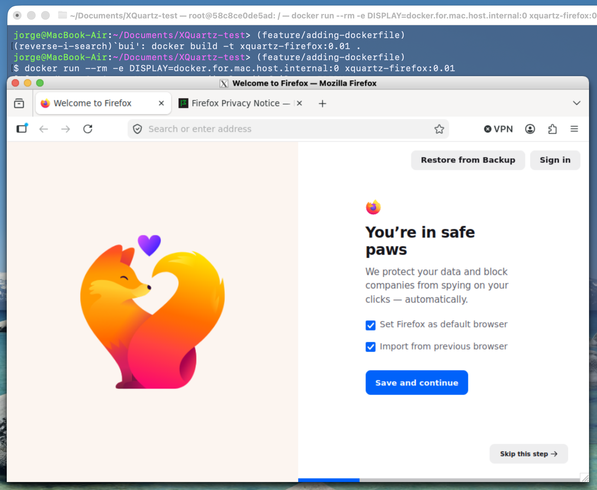

```
# dependencies
brew install xquartz

# run XQuarts and listen to localhost
open -a XQuartz
xhost +127.0.0.1

# build
docker build -t xquartz-firefox:0.01 .

# run the container
docker run --rm -e DISPLAY=docker.for.mac.host.internal:0 xquartz-firefox:0.01
```

There should be a XQuartz window with firefox


